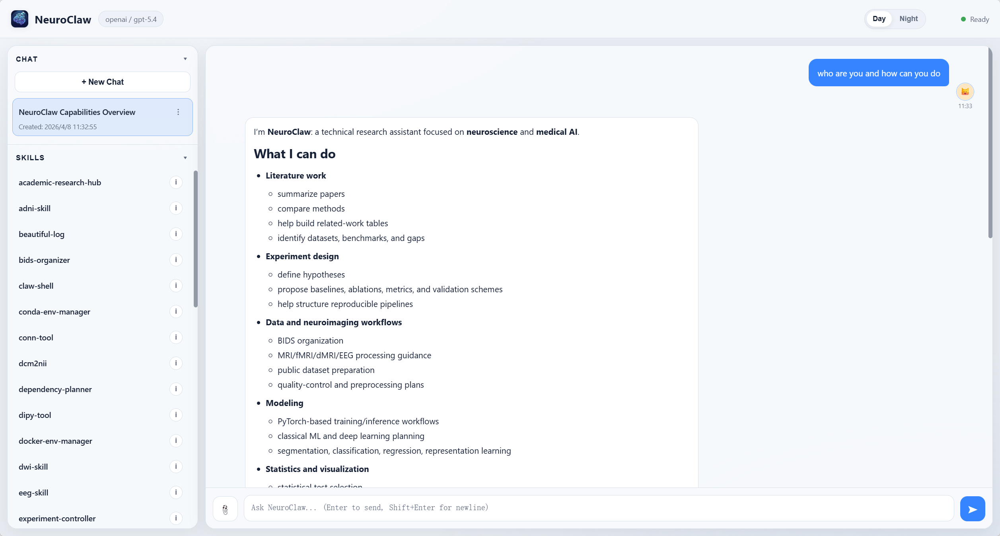

<div align="center">


# NeuroClaw：从原始数据到可复现模型

[English README](README.md)

<div align="center">

[功能概览](#-key-features) • [快速开始](#-quick-start) • [项目结构](#-project-structure) • [技能](#%EF%B8%8F-skill-quick-reference) • [致谢](#-acknowledgments)

</div>

</div>


## 📖 概述

**NeuroClaw** 是基于 [OpenClaw](https://github.com/openclaw/openclaw) 框架构建的神经科学优先平台。其核心优势在于 **神经影像数据集与模型适配**：将原始扫描快速转化为可用输入，并使临床与研究人员以最小配置成本运行深度学习模型。

神经影像数据集需要专业的预处理，而预处理质量直接决定模型有效性。许多流程假设数据已被严格整理，而 MedicalClaw 对开源模型执行的自动化支持有限（主要集中在 TimesFM 和 AlphaFold 等大型项目），导致用户需投入大量时间在环境配置上。

NeuroClaw 强调 **数据处理** 与 **模型配置/执行**。它依然是完整的 Claw 体系，但在神经科学领域，其重心是数据与模型。

**说明**
- 我们构造了 **NeuroBench** 用于评估 multi-agent 在神经影像工作流（特别是原始数据处理和模型执行）中的性能，并计划完善基准、评测现有 medical claw 与 general claw 系统。
- 每个 SKILL.md 的末尾标注作者信息，如有问题请向对应作者提交 issue。


## 🚀 更新日志

- **[2026.04.08]**：NeuroClaw Web UI 增强—真实 shell 访问与环境继承、真实中断能力、聊天界面中的实时执行显示。
- **[2026.04.06]**：开始建设 NeuroBench 用于 multi-agent 框架评估。
- **[2026.04.02]**：v0.1 发布，NeuroClaw 框架和核心功能完成。

<a id="key-features"></a>
## ✨ 核心特性

<div align="center">
  
</div>

### 🔄 数据集优先架构
围绕“处理哪类数据集”而不是“调用哪个工具”来组织能力：
- **ADNI Dataset** → 集成化 ADNI 标准处理流水线
- **UK Biobank** → 环境感知的部署适配
- **其他公共数据集** → 快速启动工具链

用户只需指定目标数据集，系统将自动推荐并编排相关技能。

### 🎯 可执行性与可复现性
- **自动依赖管理**：无需手动安装，系统自动检测并解决依赖
- **真实模型执行**：不仅提供文档，还引导并执行复现
- **环境隔离**：虚拟环境与容器化避免系统污染
- **可验证流程**：完整日志与结果追踪

### 🧠 端到端科研覆盖
- **文献检索**：arXiv 搜索、PubMed 获取、学术资源整合
- **实验设计**：文献分析、方法学评估、研究方案生成
- **数据处理**：多格式转换（DICOM ↔ NIfTI）、自动化预处理流水线
- **模型执行**：运行已发表模型，深度学习框架集成
- **结果可视化**：科学数据可视化、统计图表生成
- **论文写作**：自动草稿生成、格式标准化

### 🤝 OpenClaw 兼容性
- **NeuroClaw 现已自包含** — 无需单独安装 OpenClaw。
  内置 `core/` 引擎提供了相同的对话循环、技能加载器和工具运行时。
- `skills/`、`materials/`、`USER.md`、`SOUL.md` 仍与现有 OpenClaw 工作区完全兼容，
  如需作为插件使用也可直接集成。
- 非神经科学连接器（WhatsApp、Telegram、Slack、日历、电商、SaaS 鉴权）
  已通过 `core/config/features.json` 默认禁用，如需启用可修改配置。

---

<a id="quick-start"></a>
## 🚀 快速开始

### 前置条件
- Python >= 3.10
- Git
- *（可选）* Conda/Mamba，用于环境隔离
- *（可选）* `nvidia-smi` / `nvcc`，用于 GPU 支持

> **NeuroClaw 现已自包含** — 无需预先安装 OpenClaw。
> 内置安装程序会自动配置 Python 环境、CUDA 版本、神经影像工具链和 LLM 后端。

### 安装步骤

1. **克隆仓库**
   ```bash
   git clone https://github.com/CUHK-AIM-Group/NeuroClaw.git
   cd NeuroClaw
   ```

2. **运行安装向导**
   ```bash
   python installer/setup.py
   ```
   向导将引导你完成：
   - Python 运行时选择（系统 Python / conda / Docker）
   - CUDA / GPU 配置，以及可选的 PyTorch 自动安装
   - 神经科学工具链路径（FSL、FreeSurfer、dcm2niix 等）
   - LLM 后端（OpenAI、Anthropic 或本地模型）
   - 默认 BIDS 和输出目录

   配置保存到 `neuroclaw_environment.json`，每次会话自动加载。

   使用自动检测默认值快速配置（无需交互）：
   ```bash
   python installer/setup.py --non-interactive
   ```

3. **启动 NeuroClaw**

   **方式 A — 终端交互模式**
   ```bash
   python core/agent/main.py
   ```

   **方式 B — 浏览器 Web UI**（推荐）
   ```bash
   python core/agent/main.py --web
   ```
   启动后在浏览器中打开 **http://localhost:7080**。Web UI 提供对话界面、技能侧边栏、Markdown 渲染和代码语法高亮。

   如需自定义端口或绑定所有网络接口（如远程访问）：
   ```bash
   python core/agent/main.py --web --port 8080 --host 0.0.0.0
   ```

<div align="center">
  
</div>

### 验证安装
```bash
# 检查环境配置文件是否有效
python installer/setup.py --check

# 列出已注册的神经科学技能
python -c "
from core.skill_loader.loader import SkillLoader
from pathlib import Path
skills = SkillLoader(Path('skills')).load_all()
for s in skills:
    print(s['name'])
"
```

---

<a id="project-structure"></a>
## 📁 项目结构

```
NeuroClaw/
├── README.md                       # 英文版说明
├── README_zh.md                    # 中文版说明
├── USER.md                         # 用户配置与偏好
├── SOUL.md                         # 系统行为准则与原则
├── neuroclaw_environment.json      # 由安装程序生成 — 运行时配置（Python、CUDA、工具链、LLM）
│
├── core/                           # 自包含 NeuroClaw 引擎（无需 OpenClaw）
│   ├── agent/                      # LLM 对话循环与工具调用调度器
│   │   └── main.py                 # 入口；--web 参数启动 Web UI
│   ├── web/                        # 浏览器端 Web UI（FastAPI + WebSocket）
│   │   ├── server.py               # FastAPI 应用：WebSocket 聊天、/api/skills、/api/env
│   │   └── static/
│   │       └── index.html          # 深色主题聊天界面（Markdown + 语法高亮）
│   ├── skill-loader/               # 技能扫描器：读取 skills/*/SKILL.md 并注册工具
│   │   └── loader.py
│   ├── tool-runtime/               # 执行 handler.js / Python handlers
│   │   └── runtime.py
│   ├── session/                    # 会话持久化与上下文窗口压缩
│   │   └── manager.py
│   └── config/
│       └── features.json           # 功能开关（禁用 WhatsApp/Slack 等；启用 web_ui）
│
├── installer/                      # 自定义安装程序（替换 OpenClaw 默认向导）
│   ├── setup.py                    # 入口：python installer/setup.py
│   ├── config_wizard.py            # 交互式 6 步配置向导（含 Web UI 依赖安装）
│   └── neuro_defaults.json         # 神经科学专用默认参数模板
│
├── skills/                         # 扁平化技能目录
│   ├── academic-research-hub/
│   ├── adni-skill/
│   ├── bids-organizer/
│   ├── beautiful-log/
│   ├── claw-shell/
│   ├── conda-env-manager/
│   ├── conn-tool/
│   ├── dcm2nii/
│   ├── dependency-planner/
│   ├── dipy-tool/
│   ├── docker-env-manager/
│   ├── dti-skill/
│   ├── eeg-skill/
│   ├── experiment-controller/
│   ├── fmri-skill/
│   ├── fmriprep-tool/
│   ├── freesurfer-tool/
│   ├── fsl-tool/
│   ├── git-essentials/
│   ├── git-workflows/
│   ├── hcp-skill/
│   ├── hcppipeline-tool/
│   ├── method-design/
│   ├── mne-eeg-tool/
│   ├── multi-search-engine/
│   ├── nii2dcm/
│   ├── nilearn-tool/
│   ├── overleaf-skill/
│   ├── paper-writing/
│   ├── qsiprep-tool/
│   ├── research-idea/
│   ├── run_models/
│   ├── skill-updater/
│   ├── smri-skill/
│   └── wmh-segmentation/
│
├── neuro_bench/                    # NeuroBench 评估任务（T00–T100）
│   ├── T00_installer_validation/   # 验证安装程序输出
│   └── …
│
├── materials/                      # 研究材料与参考资源
│   ├── CVPR_2026/
│   └── examples/
│
└── LICENSE                         # 许可证

```

---

<a id="skill-quick-reference"></a>
## 🛠️ 技能速览

> **提示**：在 Web UI 的任何技能卡片上点击 ℹ️ 图标可查看展开的文档、使用示例和最近的执行日志。

### 基础层
| Skill | 功能 | 状态 |
|------|----------|--------|
| `dcm2nii` | DICOM → NIfTI 转换并保留元数据 | ✅ |
| `nii2dcm` | NIfTI → DICOM 转换以支持临床互操作 | ✅ |
| `git-essentials` | 协作所需的核心 Git 命令 | ✅ |
| `git-workflows` | 高级 Git 工作流（rebase/worktree/bisect） | ✅ |
| `multi-search-engine` | 无需 API Key 的多引擎搜索 | ✅ |
| `conda-env-manager` | Conda 环境生命周期管理 | ✅ |
| `docker-env-manager` | Docker 环境管理 | ✅ |
| `dependency-planner` | 依赖规划与安全安装流程 | ✅ |
| `claw-shell` | 专用会话下的安全命令执行入口 | ✅ |
| `overleaf-skill` | Overleaf 同步与协作写作操作 | ✅ |
| `academic-research-hub` | 多来源学术检索与论文获取 | ✅ |
| `bids-organizer` | 原始数据组织为 BIDS 结构 | ✅ |
| `brain-visualization` | 脑网络、脑区激活与 FreeSurfer 表面结果可视化 | ✅ |
| `beautiful-log` | 将 User/NeuroClaw 直接对话导出为美观 HTML 日志 | ✅ |
| `harness-core` | Harness 工程 SDK（验证、检查点、审计日志、漂移检测） | ✅ |

### 接口层（任务编排）
| Skill | 功能 | 状态 |
|------|----------|--------|
| `research-idea` | 基于文献生成研究想法 | ✅ |
| `method-design` | 形式化网络结构并推导理论组件 | ✅ |
| `experiment-controller` | 查找并执行可复现实验 | ✅ |
| `paper-writing` | 从 IDEA/METHOD/EXPERIMENT 生成分层稿件 | ✅ |
| `run_models` | 模型注册与执行编排 | ✅ |

### 子智能体层
NeuroClaw 的子智能体包括四类：**tool**、**model**、**dataset**、**modality**。

#### Tool
| Skill | 功能 | 状态 |
|------|----------|--------|
| `mne-eeg-tool` | EEG 的 MNE-Python 基础实现 | ✅ |
| `fsl-tool` | 基于 FSL 的 sMRI/fMRI/DWI 处理工具 | ✅ |
| `fmriprep-tool` | fMRIPrep 流水线封装与执行 | ✅ |
| `qsiprep-tool` | qsiPrep 扩散 MRI 流水线封装 | ✅ |
| `hcppipeline-tool` | HCP 风格处理流水线工具 | ✅ |
| `dipy-tool` | 基于 DIPY 的扩散 MRI 处理 | ✅ |
| `nibabel-skill` | 底层神经影像文件 I/O 与仿射感知数据访问 | ✅ |
| `nilearn-tool` | 快速影像特征提取与解码准备 | ✅ |
| `conn-tool` | 功能连接计算与分析 | ✅ |
| `freesurfer-tool` | 基于 FreeSurfer 的 MRI 处理与分割 | ✅ |

#### Model
| Skill | 功能 | 状态 |
|------|----------|--------|
| `wmh-segmentation` | 白质高信号分割（MARS-WMH nnU-Net） | ✅ |
| `brain_gnn` | BrainGNN：用于 fMRI 分类的图神经网络 | ✅ |
| `fm_app` | FM-APP：fMRI+sMRI 多阶段表型预测 | ✅ |
| `neurostorm` | NeuroStorm：神经影像基础模型 | ✅ |
| `glm` | 用于任务态 fMRI 激活分析与组水平推断的一二级 GLM | ✅ |
| `ica` | 基于独立成分分析的静息态网络分解 | ✅ |
| `dictlearning` | 基于字典学习的稀疏静息态网络分解 | ✅ |
| `svm` | 基于 ROI/表格特征的经典神经影像疾病分类 | ✅ |
| `spacenet` | 带稀疏系数图的体素级神经影像疾病分类 | ✅ |
| `kmeans` | 基于 K-means 聚类的脑区划分 | ✅ |
| `hierarchical` | 基于层次聚类的多尺度脑区划分 | ✅ |
| `filtering` | 面向神经影像时序信号的时间滤波去噪 | ✅ |
| `detrending` | 面向神经影像时序信号的时间漂移去除 | ✅ |

#### Dataset
| Skill | 功能 | 状态 |
|------|----------|--------|
| `adni-skill` | ADNI 数据集自动化处理流程 | ✅ |
| `hcp-skill` | HCP-YA 数据集自动化处理流程 | ✅ |
| `ukb-skill` | UKB 脑影像自动化处理流程 | ⏳ |

#### Modality
| Skill | 功能 | 状态 |
|------|----------|--------|
| `eeg-skill` | EEG 预处理与特征提取流程 | ✅ |
| `fmri-skill` | 功能 MRI 预处理与分析流程 | ✅ |
| `smri-skill` | 结构 MRI 预处理与分析流程 | ✅ |
| `dti-skill` | 扩散 MRI 预处理与分析流程 | ✅ |

**图例**：✅ 已实现 | 🏗️ 开发中 | ⏳ 规划中


---

## TODO List

### Architecture & Foundation
- ✓ Hierarchical architecture design (Interface-Subagent-Base Tool)
- ✓ Complete Interface layer implementation
- ✓ Subagent coordination mechanisms

### Dataset Ecosystem
- ✓ Complete ADNI processing chain
- ✓ HCP dataset adaptation
- ☐ UK Biobank adaptation
- ☐ Multi-dataset workflow support

### Model Reproduction & Execution
- ✓ Automatic paper model retrieval
- ✓ Automatic environment configuration
- ✓ 完整的可复现性 Harness 工程

### Community & Extensions
- ☐ Multi-institution collaboration capabilities
- ☐ Plugin ecosystem for third-party skills

---


<a id="acknowledgments"></a>
## 🙏 致谢

感谢：
- [OpenClaw](https://github.com/openclaw/openclaw) 框架贡献者
- [Karcen/rs-fMRI-Pipeline-Tutorial](https://github.com/Karcen/rs-fMRI-Pipeline-Tutorial) 提供脑可视化流程与方法参考
- 全体贡献者与用户反馈
- 开源神经科学工具社区（MNE-Python、FreeSurfer、FSL 等）
